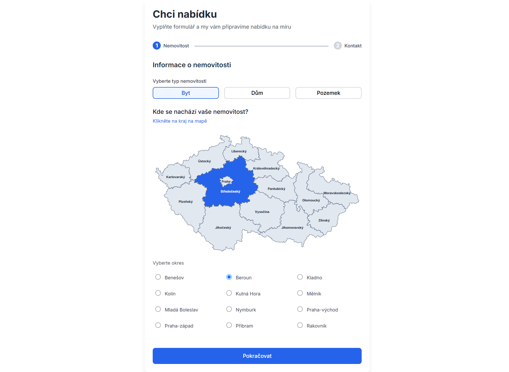
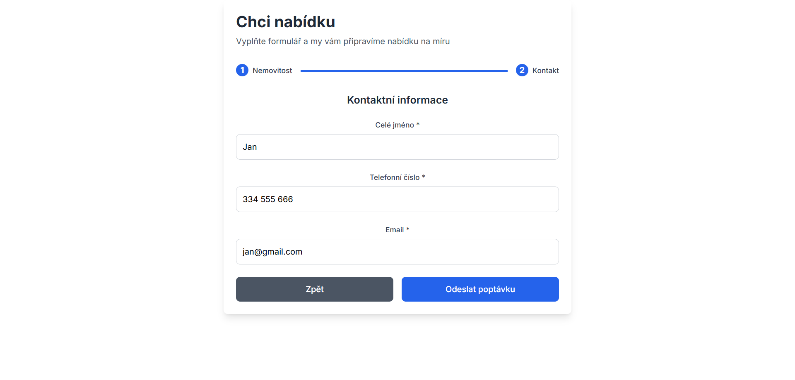
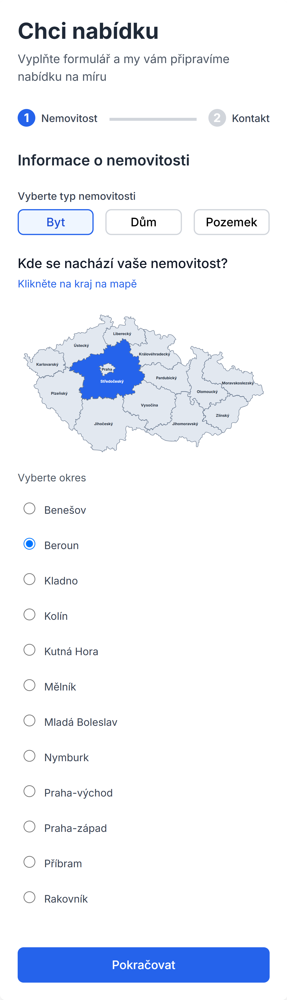
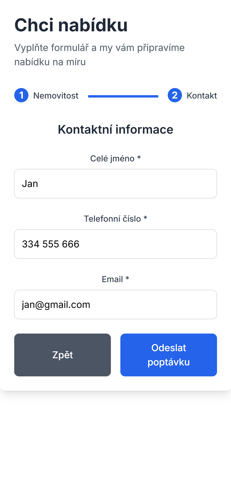

# Reas Real Estate Lead Collection System

A form for collecting real estate leads with a modern React frontend and Node.js backend.

## 🚀 Features

- **Two-step form** for collecting property and contact information
- **Czech regions and districts** with searchable dropdowns
- **Input validation** for phone numbers and email addresses
- **Modern UI** built with React and Tailwind CSS
- **RESTful API** with Express.js and MongoDB
- **Docker support** for easy deployment
- **Responsive design** that works on all devices

## 🔧 Installation & Setup

### Option 1: Docker Compose (Recommended)
### IMPORTANT: Necessary MongoDB environment variable is already in files. It's not good practice for production, but for this project I left it there so everything is running out of the box

1. **Clone the repository**
   ```bash
   git clone <your-repo-url>
   cd reas-test
   ```

2. **Run with Docker Compose**
   ```bash
   docker-compose up --build
   ```

3. **Access the application**
   - Frontend: http://localhost:3000 (redirects to /chci-nabidku)
   - Backend API: http://localhost:5000
   - MongoDB: localhost:27017

### Option 2: Manual Setup

#### Backend Setup

1. **Navigate to backend directory**
   ```bash
   cd backend
   ```

2. **Install dependencies**
   ```bash
   npm install
   ```

3. **Set up environment variables**
   Create a `.env` file in the backend directory:
   ```env
   MONGODB_URI=mongodb://localhost:27017/reas-db
   PORT=5000
   NODE_ENV=development
   ```

4. **Start MongoDB**
   Make sure MongoDB is running on your system.

5. **Start the backend server**
   ```bash
   npm run dev
   ```

#### Frontend Setup

1. **Navigate to frontend directory**
   ```bash
   cd ../frontend
   ```

2. **Install dependencies**
   ```bash
   npm install
   ```

3. **Start the React development server**
   ```bash
   npm start
   ```

## 📸 Screenshots

### Desktop View


### Tablet View


### Mobile Views
<table>
  <tr>
    <td width="50%" valign="top">
      <h4>Navigation Closed</h4>
      
    </td>
    <td width="50%" valign="top">
      <h4>Navigation Opened</h4>
      
    </td>
  </tr>
</table>

## 🛠 Tech Stack

### Frontend
- React 18+ with TypeScript
- React Router for routing
- Tailwind CSS for styling
- Form validation with custom hooks

### Backend
- Node.js with Express.js
- MongoDB for data storage
- Express Validator for input validation
- CORS enabled for cross-origin requests

### DevOps
- Docker & Docker Compose
- Environment-based configuration

## 📋 Prerequisites

- Node.js 18 or higher
- MongoDB (local installation or MongoDB Atlas)
- Docker and Docker Compose (for containerized deployment)

## 🌐 API Endpoints

### POST /lead
Submit a new lead to the system.

**Request Body:**
```json
{
  "estateType": "byt|dům|pozemek",
  "region": "Czech region name",
  "district": "Czech district name", 
  "fullname": "Full name",
  "phone": "Czech phone number (e.g., 777 123 456)",
  "email": "email@example.com"
}
```

**Response:**
```json
{
  "success": true,
  "message": "Lead saved successfully",
  "leadId": "ObjectId"
}
```

## 📱 Usage

1. **Visit the homepage** at http://localhost:3000
2. **You will be redirected to /chci-nabidku** to start the lead form
3. **Step 1**: Select property type, region, and district
4. **Step 2**: Enter contact information
5. **Submit** the form to save the lead

## 🔍 Form Validation

- **Property type**: Required selection (apartment, house, or land)
- **Region/District**: Must select valid Czech region and district
- **Full name**: Minimum 2 characters
- **Phone**: Czech phone number format (777 123 456 or +420 777 123 456)
- **Email**: Valid email address format

## 📂 Project Structure

```
reas-test/
├── backend/                  # Node.js API server
│   ├── package.json          # Backend dependencies
│   ├── server.js             # Main server file
│   ├── config.js             # Configuration
│   └── Dockerfile            # Backend Docker config
├── frontend/                 # React frontend source
│   ├── src/                  # React source code
│   │   ├── components/       # React components
│   │   │   └── LeadForm.tsx  # Two-step form
│   │   ├── App.tsx           # Main app component
│   │   └── index.tsx         # App entry point
│   ├── package.json          # Frontend dependencies
│   └── Dockerfile            # Frontend Docker config
├── docker-compose.yml        # Docker Compose configuration
├── Dockerfile.frontend       # (Optional) Frontend Docker config
├── nginx.conf                # Nginx configuration
└── README.md                 # This file
```

## 🚀 Deployment

### Production Build

1. **Build frontend**
   ```bash
   cd frontend
   npm run build
   ```

2. **Deploy with Docker Compose**
   ```bash
   docker-compose -f docker-compose.yml up --build -d
   ```

### Environment Variables

Create appropriate `.env` files for production:

**Backend .env:**
```env
MONGODB_URI=mongodb://your-mongodb-connection-string
PORT=5000
NODE_ENV=production
```
